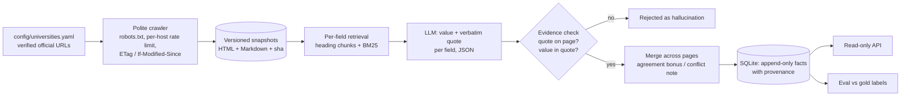

# uniagent — university facts you can trust, with the receipts

[](https://github.com/saitejacodes/universityagent/actions/workflows/ci.yml)  

Crawls official university websites politely, extracts 12 typed facts per university (tuition,
living costs, acceptance rate, deadlines, visa type, graduate outcomes, …) with a local LLM, and
**keeps an answer only if the model can quote the page sentence it came from**. Every stored value
carries its quote, URL and page-snapshot hash; every run is evaluated against gold labels.

<!-- RESULTS:START -->
### Results — 23 held-out universities, 223 facts, gold labels with evidence

Same stored pages for every system; test universities were never looked at during development.

| System | Precision | Recall | F1 [95% CI] | Hallucination rate [95% CI] | Wrong when it answers |
|---|---|---|---|---|---|
| ScrapeGraphAI (off-the-shelf, same model `qwen3:8b`) | 74.7 | 32.0 | 44.8 [34.2–54.0] | 25.0 [13.6–36.7] | 25.3 |
| v1 approach (first 4k chars, no evidence check, `llama3.1:8b`) | 67.8 | 70.9 | 69.3 [60.0–77.7] | 60.4 [47.9–72.2] | 32.2 |
| v1 approach, stronger model (`qwen3:8b`) | 73.2 | 74.9 | 74.0 [65.3–82.1] | 50.0 [37.0–62.2] | 26.8 |
| + per-field retrieval over the whole page | 74.4 | **82.9** | 78.4 [71.4–84.5] | 54.2 [45.0–63.5] | 25.6 |
| **+ evidence verification (uniagent v2)** | **83.4** | 74.9 | **78.9** [72.3–84.8] | **12.5** [5.1–19.0] | **16.6** |

- **Hallucinations 60% → 12.5%** and wrong answers halved; v2 beats v1 (p = 0.002), the same model
  without the v2 system (p = 0.035) and ScrapeGraphAI (p < 0.001) — paired bootstrap over universities.
- **The trade-off is visible, not hidden:** verification rejects some correct answers (recall 82.9 → 74.9).
- **Confidence means something:** answers that pass both evidence checks are right 88.7% of the time
  (confidence 0.9); ECE 0.088. "Derived" answers (value not literally in the quote) are right 35.7%.
- **Gold set:** 312 labels over 26 universities in 13 countries, every one with a verbatim quote
  machine-checked against its snapshot; inter-annotator κ = 0.93; 20/20 re-checked on the live sites.

Full report with per-field scores and every wrong answer: [EVAL_REPORT.md](EVAL_REPORT.md).
<!-- RESULTS:END -->

## Why v2

v1 reported **confidence 1.00 for all 30 fields** — the model grading itself — plus a
"ground truth" table where every value matched. It also sent only the first 4,000 characters of
each page to the model, and its README claimed cross-source validation that the code had removed.
v2 is rebuilt around one question: *how would we know if an answer is wrong?*

## How it works



| Piece | Decision | Evidence it matters |
|---|---|---|
| **Cleaning** (`fetch/clean.py`) | Convert the whole pruned `<body>` to Markdown (tables kept) instead of an article extractor | On facts.mit.edu, trafilatura kept 11.7k chars but dropped the founding year, enrollment *and* admit rate |
| **Retrieval** (`extract/retrieve.py`) | Heading-aware chunks, tables never split from their header, BM25 per field, round-robin packing into a 7k-char budget | Facts below the first 4,000 chars were invisible to v1 |
| **Evidence check** (`extract/grounding.py`) | Quote must fuzzy-match the page (≥ 90) and the normalised value must appear in the quote | On MIT the model answered "private" from memory; the page never says it, so it was rejected |
| **Confidence** | Derived from the checks: 0.9 accepted on the field's home page, 0.8 on a fallback page, 0.5 when the value isn't literally in the quote (derived), dropped when the quote isn't on the page | Calibration (ECE, AUROC) is measured on the test set, not asserted |
| **Typed fields** (`schema.py`) | Money = amount + ISO currency + period; dates = month/day; percentages; enums | Makes automatic, tolerance-aware scoring possible |
| **Snapshots** (`fetch/snapshots.py`) | Content-hashed, history kept on change; extraction never touches the live web | Reproducible runs; a re-crawl with no changes makes the next extraction free (LLM cache) |

### Responsible crawling

- robots.txt per host with RFC 9309 semantics (4xx → no rules, 5xx/unreachable → disallow all),
  matched on the product token `uniagent`, `Crawl-delay` honoured;
- honest User-Agent with a contact URL; no browser-fingerprint impersonation, no stealth mode;
- bot challenges (Cloudflare "Just a moment…") are recorded as `blocked` — **never bypassed**;
- one request at a time per host (≥ 2 s apart), different hosts in parallel;
- conditional requests so unchanged pages cost a 304.

Fetching uses [Scrapling](https://github.com/D4Vinci/Scrapling)'s plain `AsyncFetcher`
(with its stealth options explicitly turned off) and its `DynamicFetcher` (headless Chromium) only
for pages whose static HTML is an empty JavaScript shell.

## Quick start

```bash
make install
ollama pull qwen3:8b
.venv/bin/uniagent crawl                                     # snapshots -> data/snapshots/
.venv/bin/uniagent extract --preset full --think false       # -> runs/full-qwen3_8b/
.venv/bin/uniagent show mit                                  # current facts with their quotes
.venv/bin/uvicorn uniagent.api:app                           # GET /universities/mit
```

Add a university by adding a block to `config/universities.yaml` (verify each URL with
`scripts/probe_url.py URL REGEX`); no code changes.

## Evaluation

```bash
make extract-all      # v1 baseline, v1 w/ stronger model, + retrieval, + evidence check
make eval             # -> EVAL_REPORT.md (test split, CIs, per-field, calibration, every error)
# off-the-shelf baseline (separate venv; see the script's docstring)
PYTHONPATH=src ../baselines/.venv-sg/bin/python scripts/baseline_scrapegraph.py --model qwen3:8b
```

Method, gold-label protocol and matching rules: [docs/EVALUATION.md](docs/EVALUATION.md).

## Tests

`pytest` runs 30+ tests with no network: fetch policy (robots rules, RFC 9309 status handling,
challenge detection, 304s) against a fake transport, cleaning, chunking/retrieval, normalisation
of money/dates/percentages, evidence verification, matching rules, metrics, and an end-to-end
extraction from a stored snapshot with a scripted LLM.
